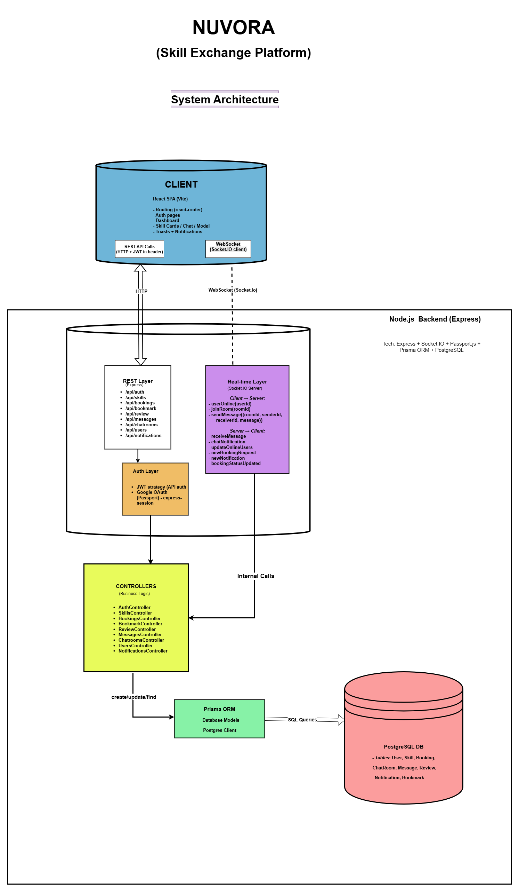

# 🌐 Nuvora

**Nuvora** is an open-source **skill exchange platform** built on the **PERN stack** (PostgreSQL, Express, React, Node.js) with **Prisma ORM**.  
It allows users to **list skills, request exchanges, book sessions, chat in real-time, get instant notifications, and receive email updates** via Brevo.  

🚀 **Live Demo:** [nuvora.onrender.com](https://nuvora.onrender.com)  

---

## ✨ Features

- 👤 **User Authentication** – JWT & Google OAuth login  
- 📚 **Skill Management** – Add, edit, delete skills (offered & wanted)  
- 📅 **Bookings System** – Request skills, accept/decline with availability validation  
- 💬 **Real-Time Chat** – Socket.io based direct messaging  
- 🔔 **Notifications** – Real-time + email (Brevo)  
- ⭐ **Reviews & Ratings** – Rate & review skills  
- 📌 **Bookmarks** – Save and manage favorite skills  
- ☁️ **Media Storage** – Profile & skill images via **Cloudinary**  
- 🗄️ **Database** – PostgreSQL on **Neon DB**  
- 🌍 **Hosting** – Frontend & Backend on **Render Free Tier**  

---

## 🏗️ System Architecture

  

---

## 🗂️ Database Schema (ER Diagram)

  

---

## ⚙️ Tech Stack

**Frontend**
- React 19, Vite, TailwindCSS, Framer Motion  
- React Router, Socket.io-client, Axios  
- Toast Notifications (react-hot-toast, react-toastify)  

**Backend**
- Node.js, Express.js  
- Prisma ORM + PostgreSQL (Neon DB)  
- JWT, Passport (Google OAuth)  
- Socket.io (real-time chat & notifications)  
- Brevo (email service)  
- Cloudinary (media storage)  

**Hosting**
- Render (Frontend + Backend)  
- Neon (Database)  
- Cloudinary (Assets)  

---

## 📂 Project Structure

